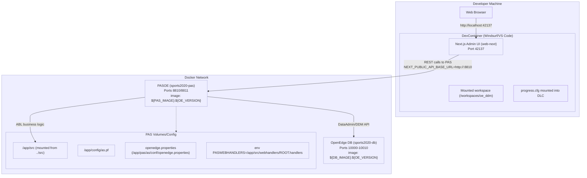
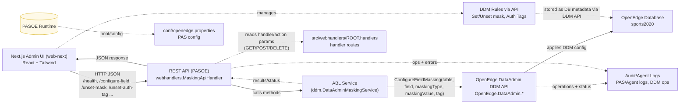

# OpenEdge Dynamic Data Masking (oe_ddm)

A comprehensive solution for masking sensitive data in OpenEdge databases to ensure privacy compliance and data protection.

## Overview

This project provides a complete data masking framework for OpenEdge ABL applications using:

- DevContainers for consistent development environments
- Windsurf IDE with integrated AI assistant
- Riverside OpenEdge ABL extension for ABL language support
- Progress Application Server (PAS) for OpenEdge for web services
- Dynamic data masking algorithms and patterns

## 🔒 Data Masking Features

- **Dynamic Masking**: Real-time data masking during query execution
- **Format Preserving**: Maintains data format while masking content
- **Configurable Rules**: Flexible masking rules per field/table
- **Audit Trail**: Complete logging of masking operations
- **Performance Optimized**: Minimal impact on database performance

## Project Structure

```
oe_ddm/
├── .devcontainer/         # DevContainer configuration
├── .github/               # GitHub workflows and templates
├── .vscode/               # VSCode configuration and settings
├── .windsurf/             # Windsurf AI assistant configuration
├── conf/                  # Configuration files for PAS
├── docs/                  # Documentation files
├── license/               # OpenEdge license files
│   └── placeholder_oe_cfg # Placeholder (replace with progress.cfg)
├── src/                   # Source code
│   ├── ddm/               # DDM service layer and related classes
│   ├── webhandlers/       # PASOE web handlers (REST endpoints)
│   ├── config/            # Configuration management
│   ├── examples/          # Example programs
│   └── test/              # Unit tests
├── tests/                 # Test files
├── web-next/              # Next.js web UI
├── .gitignore             # Git ignore rules
├── README.md              # This file
└── openedge-project.json  # Project configuration
```

## ⚠️ Important License Notice

**Warning**: All container images used in this project contain OpenEdge 12.8 installations. By using these containers, you are subject to the Progress OpenEdge End User License Agreement (EULA). Please review the license terms at: https://www.progress.com/legal/license-agreements/openedge

## Prerequisites

### IDE and Container Runtime Requirements

**Windsurf IDE** - This project is specifically designed for use with the Windsurf IDE and its integrated AI assistant. Windsurf provides enhanced OpenEdge ABL support through the OpenEdge MCP server integration.

**Alternative IDEs** - While optimized for Windsurf, this project can also work with:
- Visual Studio Code with DevContainer support
- Other IDEs with DevContainer compatibility

**Docker Desktop** - Required for this devcontainer setup to work properly. Docker and Docker Compose are minimum requirements.

### OpenEdge License Requirements

Before using this devcontainer, you must provide your own OpenEdge license file (`progress.cfg`). The license must include:

- **4GL Development System** - Required for ABL development and compilation
- **PASOE for Development** - Required for Progress Application Server for OpenEdge web services
- **Progress OpenEdge Advanced Security (Progress OEAS)** - Required for Dynamic Data Masking functionality
- **Database License** - Any of the following:
  - Workgroup Database
  - Enterprise Database
  - Advanced Enterprise Database

### License Setup

1. Copy your valid `progress.cfg` license file to the `license/` folder
2. The file must be named exactly `progress.cfg` (case-sensitive)
3. Ensure the license includes all required components listed above

## Getting Started

### Step 1: Clone and Setup

```bash
git clone https://github.com/rwdroge/oe_ddm.git
cd oe_ddm
```

### Step 2: Configure License

Copy your `progress.cfg` file to the `license/` folder (replacing the placeholder file)

### Step 3: Open in Windsurf IDE

1. Open this project in Windsurf IDE
2. The DevContainer will automatically be detected and initialized
3. Wait for the container setup to complete
4. The integrated AI assistant will have access to OpenEdge documentation through the MCP server

### Step 4: Verify Setup

The following components should be automatically configured:
- **OpenEdge ABL** extension by Riverside Software (required)
- **DevContainer** support (built-in)
- **OpenEdge MCP Server** - Provides AI assistant access to OpenEdge documentation and language reference
- **Windsurf AI Assistant** - Integrated AI coding assistant with OpenEdge expertise

### Step 5: Enable Dynamic Data Masking (required)

**Important**: DDM setup follows a specific sequence:

1. **Enable DDM** - Must be done first, before any configuration
2. **Configure DDM** - Set up masking rules, authorization tags, etc.
3. **Activate DDM** - Final step to activate the configured rules

```bash
# Step 1: Enable DDM (required before configuration)
proutil /path/to/your.db -C enableddm
```

Expected output:

```text
Feature Management: The feature Dynamic Data Masking has been enabled. (11165)
The DDM feature enable has completed successfully. (20695)
```

After enabling DDM, you can configure your masking rules using the REST API or Web UI (see Quick Start Guide below).

```bash
# Step 2: Activate DDM (run after configuration is complete)
proutil /path/to/your.db -C activateddm
```

Expected output:

```text
Feature Management: The feature Dynamic Data Masking has been activated. (11166)
The DDM feature activate has completed successfully. (20696)
```

Notes:
- Replace `/path/to/your.db` with the absolute path to your database (for example, a copy of `sports2020.db`).
- DDM requires a valid OpenEdge license that includes Dynamic Data Masking (Progress OEAS).
- **Sequence matters**: Run `enableddm` → configure DDM rules → run `activateddm`.
- Run these commands on Linux inside your OpenEdge environment/container.

## 🚀 Quick Start Guide

### 1. ABL Examples

Run the provided examples to see DDM in action:

```bash
# Basic masking examples
cd /workspaces/oe_ddm
_progres -p src/examples/CorrectDDMExample.p

# Advanced scenarios
_progres -p src/examples/ProperDDMExample.p

# Database integration (requires sports2020 connection)
_progres -p src/examples/ProperDDMExample.p -db sports2020 -S 10000 -H sports2020-db
```

### 2. REST API Setup

Start the PASOE server with DDM API:

```bash
# Start PASOE (adjust paths as needed)
$DLC/bin/tcman.sh start

# Test API health
curl http://localhost:8810/api/masking/health
```

### 3. Web UI Setup

Launch the Next.js administration interface:

```bash
cd web-next
npm install
npm run dev -- --port 42137
```

After that you can open your DDM UI at http://localhost:42137

## 📚 Examples and Usage

Looking for the story behind this project and deep dives into the architecture? Read the full blog series here:

- docs/blog/index.md

### ABL API Usage

```abl
/* Example usage programs are provided under src/examples */
/* Run them with _progres in the dev container or PASOE environment */
```

### REST API Usage

```bash
# Health check
curl http://localhost:8810/api/masking/health

# Configure field masking (set mask and authorization tag)
curl -X POST http://localhost:8810/api/masking/configure-field \
  -H "Content-Type: application/json" \
  -d '{
    "tableName": "Customer",
    "fieldName": "SSN",
    "maskingType": "FULL",
    "maskingValue": "*",
    "authTag": "PII"
  }'

# Unset masking for a field
curl -X POST http://localhost:8810/api/masking/unset-mask \
  -H "Content-Type: application/json" \
  -d '{"tableName": "Customer", "fieldName": "SSN"}'

# Create/update/delete authorization tags
curl -X POST http://localhost:8810/api/masking/create-auth-tag \
  -H "Content-Type: application/json" \
  -d '{"domainName": "GLOBAL", "authTagName": "PII"}'
```

### Configuration Files

Masking rules are defined in JSON configuration files in the `conf/` directory:

```json
{
  "tables": {
    "Customer": {
      "fields": {
        "SSN": {
          "maskType": "SSN_MASK",
          "preserveFormat": true
        },
        "CreditCard": {
          "maskType": "CREDIT_CARD_MASK",
          "preserveFormat": true
        }
      }
    }
  }
}
```

## 🏗️ Architecture Overview

### Components

1. **ABL Core/Service Layer** (`src/ddm/`)
   - `DataAdminMaskingService.cls` - Main service orchestrating DDM operations via the OpenEdge DataAdmin DDM API

2. **REST API Layer** (`src/webhandlers/`)
   - `MaskingApiHandler.cls` - PASOE web handler exposing REST endpoints
   - Configured in `conf/openedge.properties`

3. **Utilities** (as applicable)
   - Audit logging and compliance tracking within service/handlers

4. **Web UI** (`web-next/`)
   - Next.js-based administration interface
   - Modern React components with Tailwind CSS
   - Real-time API integration

5. **Examples** (`src/examples/`)
   - `CorrectDDMExample.p` - Basic usage demonstrations
   - `ProperDDMExample.p` - Complex scenarios, database integration, and performance testing

### Data Flow

```
Web UI ↔ REST API ↔ ABL Engine ↔ Database
   ↓         ↓         ↓
Audit Logs ← Logger ← Operations
```

### Infrastructure / Deployment (Dev + Prod-ish)



### Logical Architecture / Data Flow



## 🔧 Deployment Guide

### Production Deployment

1. **PASOE Configuration**
   ```bash
   # Create PASOE instance
   $DLC/bin/tcman.sh create -t oepas1 ddm-production
   
   # Configure properties
   cp conf/openedge.properties $CATALINA_BASE/conf/
   
   # Deploy ABL code
   cp -r src/* $CATALINA_BASE/webapps/ROOT/WEB-INF/openedge/
   ```

2. **Database Setup**
   ```bash
   # Create production database
   prodb create ddm-prod empty
   
   # Apply schema
   _progres -db ddm-prod -p setup/create-schema.p
   ```

3. **Web UI Deployment**
   ```bash
   cd web-next
   npm run build
   
   # Deploy to web server (nginx/apache)
   cp -r .next/static/* /var/www/ddm-admin/
   ```

### Security Configuration

- Enable HTTPS for all communications
- Configure proper authentication in PASOE
- Set up database security and access controls
- Implement audit log retention policies
- Configure network security (firewalls, VPNs)

## 📊 Monitoring and Maintenance

### Health Checks
- API endpoint: `GET /api/masking/health`
- Database connectivity monitoring
- Performance metrics tracking

### Audit and Compliance
- All operations logged with timestamps
- User activity tracking
- Data access audit trails
- Configurable retention policies

## Development Features

- Full ABL language support with syntax highlighting and code completion
- Integrated debugging capabilities
- Windsurf AI assistant with OpenEdge MCP server integration for enhanced ABL development
- AI-powered code suggestions and documentation lookup
- Access to OpenEdge database (sports2020 for testing)
- Automated testing framework
- Performance monitoring and optimization tools

## Blog

Read the blog series covering the origin story, architecture, debugging sessions, and roadmap:

- docs/blog/index.md

## Contributing

1. Fork the repository
2. Create a feature branch
3. Make your changes
4. Add tests for new functionality
5. Submit a pull request

## License

This project is licensed under the MIT License - see the LICENSE file for details.

## Security Notice

This tool is designed to help protect sensitive data. Always test masking rules thoroughly in a development environment before applying to production data.
