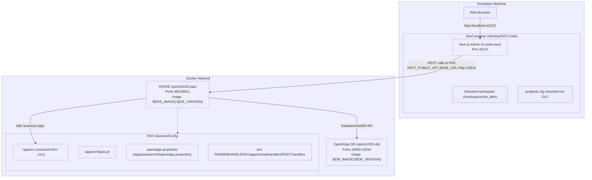
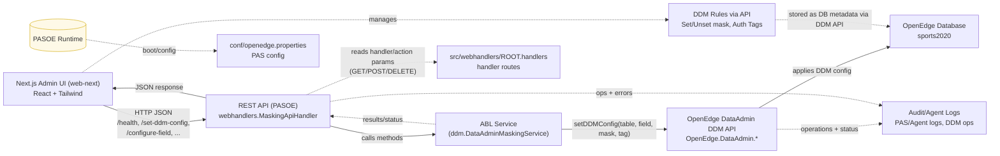

# OpenEdge Dynamic Data Masking (oe_ddm)

A comprehensive solution for masking sensitive data in OpenEdge databases to ensure privacy compliance and data protection.

## Overview

This project provides a complete data masking framework for OpenEdge ABL applications using:

- DevContainers for consistent development environments
- Windsurf IDE with integrated AI assistant
- Riverside OpenEdge ABL extension for ABL language support
- Progress Application Server (PAS) for OpenEdge for web services
- Dynamic data masking algorithms and patterns

## 🔒 Data Masking Features

- **Dynamic Masking**: Real-time data masking during query execution
- **Format Preserving**: Maintains data format while masking content
- **Configurable Rules**: Flexible masking rules per field/table
- **Audit Trail**: Complete logging of masking operations
- **Performance Optimized**: Minimal impact on database performance

## Project Structure

```
oe_ddm/
├── .devcontainer/         # DevContainer configuration
├── .github/               # GitHub workflows and templates
├── .vscode/               # VSCode configuration and settings
├── .windsurf/             # Windsurf AI assistant configuration
├── conf/                  # Configuration files for PAS
├── docs/                  # Documentation files
├── license/               # OpenEdge license files
│   └── placeholder_oe_cfg # Placeholder (replace with progress.cfg)
├── src/                   # Source code
│   ├── ddm/               # Data masking engine
│   ├── config/            # Configuration management
│   ├── examples/          # Example programs
│   └── test/              # Unit tests
├── tests/                 # Test files
├── web-next/              # Next.js web UI
├── .gitignore             # Git ignore rules
├── README.md              # This file
└── openedge-project.json  # Project configuration
```

## ⚠️ Important License Notice

**Warning**: All container images used in this project contain OpenEdge 12.8 installations. By using these containers, you are subject to the Progress OpenEdge End User License Agreement (EULA). Please review the license terms at: https://www.progress.com/legal/license-agreements/openedge

## Prerequisites

### IDE and Container Runtime Requirements

**Windsurf IDE** - This project is specifically designed for use with the Windsurf IDE and its integrated AI assistant. Windsurf provides enhanced OpenEdge ABL support through the OpenEdge MCP server integration.

**Alternative IDEs** - While optimized for Windsurf, this project can also work with:
- Visual Studio Code with DevContainer support
- Other IDEs with DevContainer compatibility

**Docker Desktop** - Required for this devcontainer setup to work properly. Docker and Docker Compose are minimum requirements.

### OpenEdge License Requirements

Before using this devcontainer, you must provide your own OpenEdge license file (`progress.cfg`). The license must include:

- **4GL Development System** - Required for ABL development and compilation
- **PASOE for Development** - Required for Progress Application Server for OpenEdge web services
- **Progress OpenEdge Advanced Security (Progress OEAS)** - Required for Dynamic Data Masking functionality
- **Database License** - Any of the following:
  - Workgroup Database
  - Enterprise Database
  - Advanced Enterprise Database

### License Setup

1. Copy your valid `progress.cfg` license file to the `license/` folder
2. The file must be named exactly `progress.cfg` (case-sensitive)
3. Ensure the license includes all required components listed above

## Getting Started

### Step 1: Clone and Setup

```bash
git clone https://github.com/rwdroge/oe_ddm.git
cd oe_ddm
```

### Step 2: Configure License

Copy your `progress.cfg` file to the `license/` folder (replacing the placeholder file)

### Step 3: Open in Windsurf IDE

1. Open this project in Windsurf IDE
2. The DevContainer will automatically be detected and initialized
3. Wait for the container setup to complete
4. The integrated AI assistant will have access to OpenEdge documentation through the MCP server

### Step 4: Verify Setup

The following components should be automatically configured:
- **OpenEdge ABL** extension by Riverside Software (required)
- **DevContainer** support (built-in)
- **OpenEdge MCP Server** - Provides AI assistant access to OpenEdge documentation and language reference
- **Windsurf AI Assistant** - Integrated AI coding assistant with OpenEdge expertise

## 🚀 Quick Start Guide

### 1. ABL Examples

Run the provided examples to see DDM in action:

```bash
# Basic masking examples
cd /workspaces/oe_ddm
_progres -p src/examples/MaskingExample.p

# Advanced scenarios
_progres -p src/examples/AdvancedMaskingExample.p

# Database integration (requires sports2020 connection)
_progres -p src/examples/DatabaseMaskingExample.p -db sports2020 -S 10000 -H sports2020-db
```

### 2. REST API Setup

Start the PASOE server with DDM API:

```bash
# Start PASOE (adjust paths as needed)
$DLC/bin/tcman.sh start

# Test API health
curl http://localhost:8810/api/masking/health
```

### 3. Web UI Setup

Launch the Next.js administration interface:

```bash
cd web-next
npm install
npm run dev -- --port 42137
```

After that you can open your DDM UI at http://localhost:42137

## 📚 Examples and Usage

### ABL API Usage

```abl
/* Initialize the masking engine */
DEFINE VARIABLE oMaskingEngine AS DataMaskingEngine NO-UNDO.
oMaskingEngine = NEW DataMaskingEngine().

/* Configure masking rules */
oMaskingEngine:AddRule("Customer", "SSN", "SSN_MASK").
oMaskingEngine:AddRule("Customer", "CreditCard", "CREDIT_CARD_MASK").

/* Apply masking */
oMaskingEngine:MaskTable("Customer").
```

### REST API Usage

```bash
# Mask a single value
curl -X POST http://localhost:8810/api/masking/mask-value \
  -H "Content-Type: application/json" \
  -d '{"value": "123-45-6789", "maskType": "SSN_MASK"}'

# Add masking rule
curl -X POST http://localhost:8810/api/masking/add-rule \
  -H "Content-Type: application/json" \
  -d '{"tableName": "Customer", "fieldName": "SSN", "maskType": "SSN_MASK"}'
```

### Configuration Files

Masking rules are defined in JSON configuration files in the `conf/` directory:

```json
{
  "tables": {
    "Customer": {
      "fields": {
        "SSN": {
          "maskType": "SSN_MASK",
          "preserveFormat": true
        },
        "CreditCard": {
          "maskType": "CREDIT_CARD_MASK",
          "preserveFormat": true
        }
      }
    }
  }
}
```

## 🏗️ Architecture Overview

### Components

1. **ABL Core Engine** (`src/ddm/`)
   - `DataMaskingEngine.cls` - Main orchestration class
   - `MaskingConfig.cls` - Configuration management
   - `MaskingAlgorithms.cls` - Masking algorithms implementation

2. **REST API Layer** (`src/api/`)
   - `MaskingApiHandler.cls` - PASOE webhandler for REST endpoints
   - Configured in `conf/openedge.properties`

3. **Utilities** (`src/utils/`)
   - `MaskingLogger.cls` - Audit logging and compliance tracking

4. **Web UI** (`web-next/`)
   - Next.js-based administration interface
   - Modern React components with Tailwind CSS
   - Real-time API integration

5. **Examples** (`src/examples/`)
   - `MaskingExample.p` - Basic usage demonstrations
   - `AdvancedMaskingExample.p` - Complex scenarios and performance testing
   - `DatabaseMaskingExample.p` - Database integration examples

### Data Flow

```
Web UI ↔ REST API ↔ ABL Engine ↔ Database
   ↓         ↓         ↓
Audit Logs ← Logger ← Operations
```

### Infrastructure / Deployment (Dev + Prod-ish)


```mermaid
flowchart TB
    subgraph DevMachine["Developer Machine"]
      BROWSER["Web Browser"]
      subgraph DevContainer["DevContainer (Windsurf/VS Code)"]
        NEXT["Next.js Admin UI (web-next)\nPort 42137"]
        VOL1["Mounted workspace (/workspaces/oe_ddm)"]
        VOL2["progress.cfg mounted into DLC"]
      end
    end
  
    subgraph DockerNet["Docker Network"]
      DB["OpenEdge DB (sports2020-db)\nPorts 10000-10010\nimage: ${DB_IMAGE}:${OE_VERSION}"]
      PAS["PASOE (sports2020-pas)\nPorts 8810/8811\nimage: ${PAS_IMAGE}:${OE_VERSION}"]
  
      subgraph PASVols["PAS Volumes/Config"]
        SRC["/app/src (mounted from ../src)"]
        AS_PF["/app/config/as.pf"]
        OEPROP["openedge.properties\n(/app/pas/as/conf/openedge.properties)"]
        WEBHANDLER["env PASWEBHANDLERS=/app/src/webhandlers/ROOT.handlers"]
      end
    end
  
    BROWSER -- "http://localhost:42137" --> NEXT
    NEXT -- "REST calls to PAS\nNEXT_PUBLIC_API_BASE_URL=http://<host>:8810" --> PAS
  
    PAS -- "ABL business logic" --> SRC
    PAS -- "DataAdmin/DDM API" --> DB
  
    DevContainer --- VOL1
    DevContainer --- VOL2
  
    PAS -.-> PASVols
  
    classDef infra fill:#eef,stroke:#99c,stroke-width:1px;
    class DevContainer,DB,PAS,PASVols,SRC,AS_PF,OEPROP,WEBHANDLER,NEXT,DevMachine,DockerNet infra;
```

### Logical Architecture / Data Flow


```mermaid
flowchart LR
    UI["Next.js Admin UI (web-next)\nReact + Tailwind"]
    REST["REST API (PASOE)\nwebhandlers.MaskingApiHandler"]
    SERVICE["ABL Service\n(ddm.DataAdminMaskingService)"]
    DDMAPI["OpenEdge DataAdmin DDM API\nOpenEdge.DataAdmin.*"]
    DB["OpenEdge Database\nsports2020"]
  
    LOGS["Audit/Agent Logs\nPAS/Agent logs, DDM ops"]
    CONF["conf/openedge.properties\nPAS config"]
    HANDLERS["src/webhandlers/ROOT.handlers\nhandler routes"]
    RULES["DDM Rules via API\nSet/Unset mask, Auth Tags"]
  
    UI -- "HTTP JSON\n/health, /set-ddm-config,\n/configure-field, ... " --> REST
    REST -- "calls methods" --> SERVICE
    SERVICE -- "setDDMConfig(table, field, mask, tag)" --> DDMAPI
    DDMAPI -- "applies DDM config" --> DB
  
    REST -. "reads handler/action params\n(GET/POST/DELETE)" .-> HANDLERS
    PASOE[("PASOE Runtime")]:::ctrl
    PASOE -. "boot/config" .-> CONF
  
    SERVICE -. "results/status" .-> REST
    REST -- "JSON response" --> UI
  
    DDMAPI -. "operations + status" .-> LOGS
    REST -. "ops + errors" .-> LOGS
  
    UI -. "manages" .-> RULES
    RULES -. "stored as DB metadata via DDM API" .-> DB
  
    classDef ctrl fill:#fef9e7,stroke:#d4ac0d,stroke-width:1px;
```

## 🔧 Deployment Guide

### Production Deployment

1. **PASOE Configuration**
   ```bash
   # Create PASOE instance
   $DLC/bin/tcman.sh create -t oepas1 ddm-production
   
   # Configure properties
   cp conf/openedge.properties $CATALINA_BASE/conf/
   
   # Deploy ABL code
   cp -r src/* $CATALINA_BASE/webapps/ROOT/WEB-INF/openedge/
   ```

2. **Database Setup**
   ```bash
   # Create production database
   prodb create ddm-prod empty
   
   # Apply schema
   _progres -db ddm-prod -p setup/create-schema.p
   ```

3. **Web UI Deployment**
   ```bash
   cd web-next
   npm run build
   
   # Deploy to web server (nginx/apache)
   cp -r .next/static/* /var/www/ddm-admin/
   ```

### Security Configuration

- Enable HTTPS for all communications
- Configure proper authentication in PASOE
- Set up database security and access controls
- Implement audit log retention policies
- Configure network security (firewalls, VPNs)

## 📊 Monitoring and Maintenance

### Health Checks
- API endpoint: `GET /api/masking/health`
- Database connectivity monitoring
- Performance metrics tracking

### Audit and Compliance
- All operations logged with timestamps
- User activity tracking
- Data access audit trails
- Configurable retention policies

## Development Features

- Full ABL language support with syntax highlighting and code completion
- Integrated debugging capabilities
- Windsurf AI assistant with OpenEdge MCP server integration for enhanced ABL development
- AI-powered code suggestions and documentation lookup
- Access to OpenEdge database (sports2020 for testing)
- Automated testing framework
- Performance monitoring and optimization tools

## Contributing

1. Fork the repository
2. Create a feature branch
3. Make your changes
4. Add tests for new functionality
5. Submit a pull request

## License

This project is licensed under the MIT License - see the LICENSE file for details.

## Security Notice

This tool is designed to help protect sensitive data. Always test masking rules thoroughly in a development environment before applying to production data.
