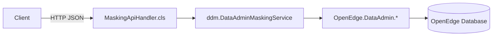

# Inside the ABL Back-end: Service Layer + PASOE Webhandlers for DDM

## Overview
Our back-end is a thin, clear separation:
- ABL service layer in `src/ddm/` with `ddm.DataAdminMaskingService` orchestrating OpenEdge DataAdmin DDM APIs.
- PASOE webhandlers in `src/webhandlers/` mapping HTTP requests to service calls.
- PAS configuration in `conf/openedge.properties` and handler mappings in `src/webhandlers/ROOT.handlers`.



## Key ABL service methods
Source: `src/ddm/DataAdminMaskingService.cls`

Configure field masking (high-level wrapper):
```abl
METHOD PUBLIC LOGICAL ConfigureFieldMasking(INPUT pcTableName AS CHARACTER,
                                           INPUT pcFieldName AS CHARACTER,
                                           INPUT pcMaskingType AS CHARACTER,
                                           INPUT pcMaskingValue AS CHARACTER,
                                           INPUT pcAuthTag AS CHARACTER):
  DEFINE VARIABLE cMaskValue AS CHARACTER NO-UNDO.
  CASE pcMaskingType:
    WHEN "FULL" THEN cMaskValue = pcMaskingValue.
    WHEN "PARTIAL" THEN cMaskValue = pcMaskingValue.
    WHEN "CONDITIONAL" THEN cMaskValue = pcMaskingValue.
    OTHERWISE cMaskValue = pcMaskingValue.
  END CASE.
  RETURN SetFieldDDMConfig(pcTableName, pcFieldName, cMaskValue, pcAuthTag).
END METHOD.
```

Unset mask and auth tag:
```abl
METHOD PUBLIC LOGICAL UnsetMaskForField(INPUT pcTableName AS CHARACTER,
                                        INPUT pcFieldName AS CHARACTER):
  RETURN oDataAdminService:unsetDDMMask(pcTableName, pcFieldName).
END METHOD.

METHOD PUBLIC LOGICAL UnsetAuthTagForField(INPUT pcTableName AS CHARACTER,
                                           INPUT pcFieldName AS CHARACTER):
  RETURN oDataAdminService:unsetDDMAuthTag(pcTableName, pcFieldName).
END METHOD.
```

Readback for visibility:
```abl
METHOD PUBLIC LOGICAL GetFieldDDMConfig(INPUT pcTableName AS CHARACTER,
                                        INPUT pcFieldName AS CHARACTER,
                                        OUTPUT pcMaskValue AS CHARACTER,
                                        OUTPUT pcAuthTag AS CHARACTER):
  oDataAdminService:GetFieldDDMConfig(pcTableName, pcFieldName, OUTPUT pcMaskValue, OUTPUT pcAuthTag) NO-ERROR.
  IF ERROR-STATUS:ERROR THEN RETURN FALSE.
  pcMaskValue = TRIM(pcMaskValue).
  pcAuthTag   = TRIM(pcAuthTag).
  RETURN TRUE.
END METHOD.
```

## REST endpoints (examples)
Handled by `src/webhandlers/MaskingApiHandler.cls` and consumed by the UI via `web-next/src/services/api.ts`:
- `GET /api/masking/health`
- `POST /api/masking/configure-field`
- `POST /api/masking/unset-mask`
- `POST /api/masking/unset-auth-tag`
- `POST /api/masking/create-auth-tag`
- `POST /api/masking/update-auth-tag`
- `DELETE /api/masking/delete-auth-tag`
- `GET /api/masking/roles`, `GET /api/masking/users`, `GET /api/masking/auth-tags`
- `GET /api/masking/tables`, `GET /api/masking/fields?tableName=...`
- `GET /api/masking/table-configs?tableName=...`

## cURL examples
Configure a mask:
```bash
curl -X POST http://localhost:8810/api/masking/configure-field \
  -H "Content-Type: application/json" \
  -d '{
    "tableName": "Customer",
    "fieldName": "SSN",
    "maskingType": "FULL",
    "maskingValue": "*",
    "authTag": "PII"
  }'
```

Unset a mask:
```bash
curl -X POST http://localhost:8810/api/masking/unset-mask \
  -H "Content-Type: application/json" \
  -d '{"tableName": "Customer", "fieldName": "SSN"}'
```

## Notes on PASOE configuration
- Handlers are registered via `src/webhandlers/ROOT.handlers` and properties in `conf/openedge.properties`.
- Keep service logic in `src/ddm/` and avoid coupling HTTP concerns into business logic.

## Repository links
- ABL service: https://github.com/rwdroge/oe_ddm/blob/main/src/ddm/DataAdminMaskingService.cls
- PASOE handler: https://github.com/rwdroge/oe_ddm/blob/main/src/webhandlers/MaskingApiHandler.cls
- Handler mapping: https://github.com/rwdroge/oe_ddm/blob/main/src/webhandlers/ROOT.handlers
- PAS config: https://github.com/rwdroge/oe_ddm/blob/main/conf/openedge.properties
- UI API client (consuming endpoints): https://github.com/rwdroge/oe_ddm/blob/main/web-next/src/services/api.ts

---

Prev: [Why We Built a Modern DDM Admin for OpenEdge](./01-why-ddm-openedge.md)

Next: [Building the DDM Admin UI with Next.js 14](./03-frontend-admin-ui-nextjs.md)
